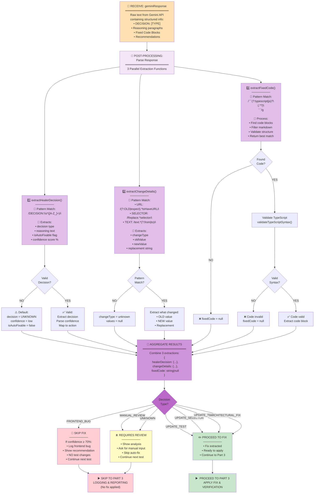
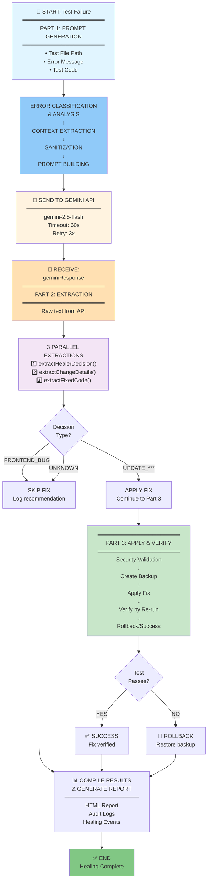

# Gemini Response Processing Flowchart - 3-Part Breakdown

> **Recommended**: View these 3 diagrams in sequence for better understanding of the complete healing pipeline.

---

## 📌 COMPLETE FULL FLOW (Reference)

For the complete end-to-end flow, scroll to the bottom of this document.

---

# PART 1️⃣: PROMPT GENERATION FLOW

## What goes INTO Gemini API?

```mermaid
graph TD
    A["📌 START: Test Failure<br/>─────────<br/>• Test File Path<br/>• Error Message<br/>• Test Code<br/>(from results.json)"] --> B["🔍 ERROR CLASSIFICATION<br/>─────────<br/>extractTestInfo()"]
    
    B --> B1["Classify Error Type<br/>classifyErrorType():<br/>• SELECTOR<br/>• ASSERTION<br/>• TIMEOUT<br/>• NAVIGATION<br/>• DOM_ARCHITECTURE<br/>• INFRASTRUCTURE"]
    
    B1 --> B2{"Infrastructure<br/>Error?"}
    B2 -->|YES| END1["🛑 SKIP HEALING<br/>Return error info<br/>Cannot heal:<br/>• Connection issues<br/>• Port problems<br/>• Browser crashed"]
    B2 -->|NO| C["📊 DEEP ANALYSIS<br/>─────────<br/>detectDOMArchitectureIssues()<br/>detectFrontendChanges()<br/>analyzeTestIntentAndSelectors()"]
    
    C --> C1["🎯 CONTEXT EXTRACTION<br/>─────────<br/>1. Extract UI elements:<br/>   extractUIElementsFromSourceCode()<br/>2. Analyze Playwright trace:<br/>   extractElementsFromTrace()<br/>3. Generate selector guidance:<br/>   generateSelectorGuidance()<br/>4. Build button text guidance:<br/>   generateButtonTextGuidance()"]
    
    C1 --> C2["🔐 SANITIZATION LAYER<br/>─────────<br/>1. Sanitize error message<br/>   sanitizeErrorMessage()<br/>2. Sanitize test code<br/>   sanitizeForPrompt()<br/>3. Remove sensitive data:<br/>   • Local paths<br/>   • Email addresses<br/>   • API keys"]
    
    C2 --> C3["📋 VALIDATE CODE SIZE<br/>─────────<br/>validateTestCodeSize():<br/>• Max 50KB test code<br/>• Max 5KB error message<br/>• Truncate if needed<br/>with warning"]
    
    C3 --> C4["🧩 BUILD PROMPT CONTEXT<br/>─────────<br/>Combine all extracted data:<br/>1. Error classification<br/>2. Test intent analysis<br/>3. UI element mapping<br/>4. DOM architecture info<br/>5. Trace element data<br/>6. Selector guidance<br/>7. Button text guidance<br/>8. Frontend changes detected"]
    
    C4 --> C5["📝 GENERATE ANALYSIS PROMPT<br/>═════════════════════<br/>generateAnalysisPrompt()<br/>───────────────────<br/>Result: Comprehensive prompt<br/>with all context for Gemini"]
    
    C5 --> D["🚀 SEND TO GEMINI API<br/>═════════════════════<br/>analyzeWithGemini()<br/>─────────────────────<br/>📤 Request Details:<br/>• Model: gemini-2.5-flash<br/>• Max Output: 8192 tokens<br/>• Timeout: 60 seconds<br/>• Rate Limit: 5 calls/min<br/>• Temperature: 0.7"]
    
    D --> D1{"API Success?"}
    D1 -->|ERROR| D2["🔄 RETRY LOGIC<br/>─────────<br/>Max 3 retries<br/>Exponential backoff:<br/>• Attempt 1: 1s<br/>• Attempt 2: 2s<br/>• Attempt 3: 4s"]
    D2 --> D1
    D1 -->|TIMEOUT| D3["❌ API TIMEOUT<br/>After 60 seconds"]
    D1 -->|MAX RETRIES| D4["❌ MAX RETRIES EXCEEDED"]
    D3 --> END2["🛑 STOP<br/>Healing failed"]
    D4 --> END3["🛑 STOP<br/>Healing failed"]
    
    D1 -->|SUCCESS| E["✅ RESPONSE RECEIVED<br/>═════════════════════<br/>📨 geminiResponse contains:<br/>• DECISION: [TYPE]<br/>• Reasoning text<br/>• Change details<br/>• Fixed code blocks<br/>• Recommendations"]
    
    E --> PART2["▶️  PROCEED TO PART 2<br/>GEMINI RESPONSE & EXTRACTION"]
    
    style A fill:#e1f5ff
    style B fill:#bbdefb
    style B1 fill:#90caf9
    style C fill:#64b5f6
    style C1 fill:#42a5f5
    style C2 fill:#2196f3
    style C3 fill:#1e88e5
    style C4 fill:#1976d2
    style C5 fill:#1565c0
    style D fill:#fff3e0
    style E fill:#ffe0b2
    style PART2 fill:#c8e6c9
    style END1 fill:#ffcdd2
    style END2 fill:#ffcdd2
    style END3 fill:#ffcdd2
```



---

## 📋 PART 1 Explanation: Prompt Generation

**Goal**: Build a comprehensive, context-rich prompt to send to Gemini API

**Key Stages**:
1. **Error Classification** - Identify if error can be healed
2. **Deep Analysis** - Extract test intent, detect DOM issues, analyze traces
3. **Context Extraction** - Pull UI elements, generate guidance
4. **Sanitization** - Remove sensitive data, prevent injection
5. **Prompt Building** - Combine all context into one cohesive prompt
6. **API Request** - Send with retry logic and timeout protection

**Output**: `geminiResponse` string ready for parsing

**Functions in Part 1**:
- `extractTestInfo()` - Parse test failure
- `classifyErrorType()` - Determine if healable
- `detectDOMArchitectureIssues()` - Find Shadow DOM/iframes
- `detectFrontendChanges()` - Identify UI changes
- `extractUIElementsFromSourceCode()` - Pull from source files
- `extractElementsFromTrace()` - Parse Playwright traces
- `generateAnalysisPrompt()` - Build final prompt
- `analyzeWithGemini()` - Send to API with retries

---

# PART 2️⃣: GEMINI RESPONSE & EXTRACTION

## What comes OUT of Gemini API? How to parse it?



---

## 📋 PART 2 Explanation: Response Extraction & Parsing

**Goal**: Extract structured data from Gemini's unstructured response

**Key Stages**:
1. **Receive Response** - Raw text from Gemini API
2. **3 Parallel Extraction Functions** - Parse decision, changes, code simultaneously
3. **Validation** - Check if extractions are valid/complete
4. **Aggregation** - Combine into structured objects
5. **Decision Logic** - Determine next action

**Output**: `{ healerDecision, changeDetails, fixedCode }` + action to take

**The 3 Extraction Functions**:

### **extractHealerDecision(geminiResponse)**
```javascript
Pattern: /DECISION:\s*([A-Z_]+)/i
Valid decisions:
- FRONTEND_BUG: Bug in frontend code (skip test fix)
- UPDATE_TEST: Update test logic
- UPDATE_SELECTOR: Change selector
- UPDATE_TEXT: Change expected text
- ARCHITECTURAL_FIX: Fix DOM navigation
- MANUAL_REVIEW: Needs human review

Output:
{
  decision: string,
  reasoning: string,
  isAutoFixable: boolean,
  confidence: 0-100
}
```

### **extractChangeDetails(geminiResponse, testInfo)**
```javascript
Patterns:
- URL: /(?:OLD|current|expect).*toHaveURL/i
- SELECTOR: /Replace.*selector.*(?:with|→|to)/i
- TEXT: /text.*(?:from|change|to)/i
- LABEL: /label.*(?:change|update)/i

Output:
{
  changeType: 'url|selector|text|label|unknown',
  oldValue: string|null,
  newValue: string|null,
  replacement: string|null
}
```

### **extractFixedCode(geminiResponse)**
```javascript
Pattern: /```(?:typescript|javascript)?\n([\s\S]*?)\n```/g

Process:
1. Find all code blocks in response
2. Filter out markdown headers/comments
3. Validate TypeScript syntax
4. Accept: imports, test(), expect(), locators
5. Return highest quality block

Output:
fixedCode: string (full code) | null (not found)
```

**Functions in Part 2**:
- `extractHealerDecision()` - Parse AI decision
- `extractChangeDetails()` - Identify changes
- `extractFixedCode()` - Extract code block
- `extractReasoningFromResponse()` - Pull reasoning text
- `calculateConfidenceFromResponse()` - Score confidence
- `validateTypeScriptSyntax()` - Validate extracted code

---

# PART 3️⃣: APPLY FIX & VERIFICATION

## How to apply and verify the fix works?

```mermaid
graph TD
    G2["✏️ PROCEED TO FIX<br/>═════════════════════<br/>Extracted data:<br/>• healerDecision<br/>• fixedCode<br/>• changeDetails"]
    
    G2 --> H["🔐 SECURITY & VALIDATION<br/>═════════════════════<br/>Pre-Application Checks"]
    
    H --> H1["1. PATH VALIDATION<br/>─────────<br/>validateFilePath():<br/>• Check for ..<br/>• Block absolute paths<br/>• Verify whitelist<br/>• Prevent traversal"]
    
    H1 --> H2["2. CODE SIZE CHECK<br/>─────────<br/>• Empty code? ❌<br/>• Size ≤ 1MB? ✅<br/>• Contains code patterns?<br/>  - import?<br/>  - test()?<br/>  - expect()?"]
    
    H2 --> H3["3. SYNTAX VALIDATION<br/>─────────<br/>validateTypeScriptSyntax():<br/>• Parse TypeScript<br/>• Check for errors<br/>• Validate structure<br/>• Ensure completeness"]
    
    H3 --> H3_CHECK{"All Checks<br/>Passed?"}
    
    H3_CHECK -->|NO| H3_ERR["❌ VALIDATION FAILED<br/>─────────<br/>• Log error<br/>• Skip this test<br/>• Continue next"]
    
    H3_CHECK -->|YES| I["💾 CREATE BACKUP<br/>═════════════════════<br/>createBackup():<br/>─────────<br/>• Read original file<br/>• Zip original content<br/>• Save to<br/>  reports/audit/<br/>  .healer-backups/<br/>  [testname]_[timestamp].zip<br/>• Track backup path"]
    
    H3_ERR --> END_VALIDATE["🛑 STOP"]
    
    I --> J["🔧 APPLY FIXES<br/>═════════════════════<br/>applyFixes()"]
    
    J --> J1["WRITE TO FILE<br/>─────────<br/>fs.writeFileSync():<br/>• Write fixedCode<br/>• Replace original<br/>• Close file<br/>• Update timestamp"]
    
    J1 --> J1_SUCCESS{"Write<br/>Success?"}
    
    J1_SUCCESS -->|NO| J1_ERR["❌ FILE WRITE ERROR<br/>─────────<br/>• Backup exists?<br/>  ├─ YES: Rollback<br/>  └─ NO: Log error"]
    
    J1_SUCCESS -->|YES| K["✅ VERIFY FIX<br/>═════════════════════<br/>verifyFix()"]
    
    J1_ERR --> END_APPLY["🛑 STOP"]
    
    K --> K1["RE-RUN TEST<br/>─────────<br/>spawnSync():<br/>npx playwright test<br/>[file]<br/>─────────<br/>Capture:<br/>• Exit code<br/>• stdout<br/>• stderr<br/>• duration"]
    
    K1 --> K2{"Test<br/>Passes?"}
    
    K2 -->|YES| K2_PASS["✅ SUCCESS<br/>─────────<br/>Fix verified<br/>Test now passes"]
    
    K2 -->|NO| K2_FAIL["⚠️  FAILURE<br/>─────────<br/>Fix didn't work<br/>Test still fails"]
    
    K2_PASS --> L["📋 LOG SUCCESS<br/>═════════════════════<br/>logHealingEvent()"]
    
    L --> L1["Record Event:<br/>• Event type: 'element_healed'<br/>• Test name<br/>• Failed locator<br/>• Working locator<br/>• Fixed status: true<br/>• Change type<br/>• Confidence<br/>• Duration"]
    
    L1 --> METRICS_PASS["📊 UPDATE METRICS<br/>─────────<br/>• Fixed count++<br/>• Verified count++<br/>• Success logged"]
    
    K2_FAIL --> M["🔄 ROLLBACK<br/>═════════════════════<br/>rollbackFix()"]
    
    M --> M1["RESTORE FROM BACKUP<br/>─────────<br/>• Check backup exists<br/>• Read backup zip<br/>• Extract original code<br/>• Write to test file<br/>• Verify restoration"]
    
    M1 --> M2["📋 LOG ROLLBACK<br/>─────────<br/>logHealingEvent():<br/>• Event: 'verification_failed'<br/>• Reason: Fix didn't work<br/>• Rollback: success/fail<br/>• Duration"]
    
    M2 --> METRICS_FAIL["📊 UPDATE METRICS<br/>─────────<br/>• Fixed count--<br/>• Failed count++<br/>• Rollback logged"]
    
    METRICS_PASS --> N["📊 COMPILE RESULTS<br/>═════════════════════<br/>Build Healing Report"]
    METRICS_FAIL --> N
    END_VALIDATE --> N
    END_APPLY --> N
    
    N --> N1["CALCULATE METRICS<br/>─────────<br/>• Total tests processed<br/>• Fixed count<br/>• Verified count<br/>• Failed count<br/>• Success rate %<br/>• Average confidence<br/>• Total duration"]
    
    N1 --> N2["GENERATE REPORTS<br/>─────────<br/>• healingResults object<br/>• generateHtmlReport()<br/>• displayHealingSummary()<br/>• persistLogs()<br/>• Save audit trail"]
    
    N2 --> O["📤 OUTPUT RESULTS<br/>═════════════════════<br/>Display to user:<br/>• Console summary<br/>• HTML report at:<br/>  e2e/playwright-report/<br/>• Audit logs<br/>• Healing events<br/>• Backup locations"]
    
    O --> END7["✅ END<br/>Healing Session Complete"]
    
    style G2 fill:#c8e6c9
    style H fill:#fce4ec
    style H1 fill:#f8bbd0
    style H2 fill:#f48fb1
    style H3 fill:#f06292
    style I fill:#e8f5e9
    style J fill:#fff9c4
    style K fill:#f1f8e9
    style L fill:#e0f2f1
    style K2_PASS fill:#a5d6a7
    style K2_FAIL fill:#ffcdd2
    style M fill:#ffcdd2
    style METRICS_PASS fill:#a5d6a7
    style METRICS_FAIL fill:#ffcdd2
    style N fill:#f0f4c3
    style O fill:#c8e6c9
    style END7 fill:#81c784
    style END_VALIDATE fill:#ffcdd2
    style END_APPLY fill:#ffcdd2
```



---

## 📋 PART 3 Explanation: Apply, Verify & Report

**Goal**: Apply the fix and confirm it works; if not, rollback safely

**Key Stages**:
1. **Security Validation** - 3-tier checks before applying
2. **Backup Creation** - Save original before changes
3. **Apply Fix** - Write new code to test file
4. **Verification** - Re-run test to confirm fix
5. **Rollback or Success** - Handle outcome
6. **Logging & Reporting** - Track results

**Output**: Healed test + HTML report + audit logs

**Functions in Part 3**:
- `validateFilePath()` - Security check
- `validateTestCodeSize()` - Size check
- `validateTypeScriptSyntax()` - Syntax check
- `createBackup()` - Create backup zip
- `applyFixes()` - Write to file
- `verifyFix()` - Re-run test
- `rollbackFix()` - Restore from backup
- `logHealingEvent()` - Record event
- `generateHtmlReport()` - Create report
- `displayHealingSummary()` - Console output

---

## 🔗 How the 3 Parts Connect

```
┌─────────────────────────────────────────────┐
│ PART 1: PROMPT GENERATION                   │
│ ✓ Extract test info                         │
│ ✓ Analyze test & frontend                   │
│ ✓ Build context                             │
│ ✓ Create comprehensive prompt               │
│ ✓ Send to Gemini API                        │
│ OUTPUT: geminiResponse (raw text)           │
└────────────────┬────────────────────────────┘
                 │
                 ▼
┌─────────────────────────────────────────────┐
│ PART 2: RESPONSE EXTRACTION                 │
│ ✓ Parse geminiResponse                      │
│ ✓ Extract decision (extractHealerDecision)  │
│ ✓ Extract changes (extractChangeDetails)    │
│ ✓ Extract code (extractFixedCode)           │
│ ✓ Validate extractions                      │
│ OUTPUT: {decision, changes, fixedCode}      │
└────────────────┬────────────────────────────┘
                 │
                 ▼
         🔀 Decision Logic
         ├─ FRONTEND_BUG → Skip
         └─ UPDATE_*** → Apply
                 │
                 ▼
┌─────────────────────────────────────────────┐
│ PART 3: APPLY FIX & VERIFICATION            │
│ ✓ Security validation                       │
│ ✓ Backup creation                           │
│ ✓ Apply fixes to file                       │
│ ✓ Verify by re-running test                 │
│ ✓ Rollback if fails                         │
│ ✓ Log results & generate report             │
│ OUTPUT: HTML report + audit logs            │
└─────────────────────────────────────────────┘
```

---

## ⚠️ Error Handling Across All 3 Parts

```
Part 1: Error during API call?
  → Retry 3x with exponential backoff
  → If max retries exceeded → Stop

Part 2: Invalid extraction?
  → Use defaults (UNKNOWN decision)
  → Log warning
  → Proceed to Part 3 (may skip fix)

Part 3: Verification failed?
  → Automatic rollback to backup
  → Restore original file
  → Log failure
  → Continue to next test
```

---

## 📚 Complete Reference: Full End-to-End Flow

For the complete unbroken flow including all 3 parts, see below:



---

## 📊 Summary Table: 3-Part Breakdown

| **PART** | **Function** | **Input** | **Output** | **Key Functions** |
|----------|-----------|--------|---------|------------------|
| **1: Prompt Generation** | Build context-rich prompt for Gemini | Test failure data | `geminiResponse` from API | `extractTestInfo()`, `classifyErrorType()`, `generateAnalysisPrompt()`, `analyzeWithGemini()` |
| **2: Response Extraction** | Parse & structure Gemini's response | `geminiResponse` | `{healerDecision, changeDetails, fixedCode}` | `extractHealerDecision()`, `extractChangeDetails()`, `extractFixedCode()` |
| **3: Apply & Verify** | Apply fix & confirm it works | Extracted fix data | HTML report + audit logs | `createBackup()`, `applyFixes()`, `verifyFix()`, `rollbackFix()`, `logHealingEvent()` |

---

## 🎯 Quick Reference: What Happens Where

- **Need to understand what data goes to Gemini?** → Part 1
- **Need to understand how to parse Gemini's response?** → Part 2
- **Need to understand how fixes are applied & verified?** → Part 3
- **Want complete end-to-end flow?** → See "Complete Reference" diagram above

---

## 📋 Key Functions Summary (All 3 Parts)

### PART 1 Functions: Prompt Generation
- `extractTestInfo()` - Parse test failure details
- `classifyErrorType()` - Determine if healable
- `detectDOMArchitectureIssues()` - Find Shadow DOM/iframes
- `detectFrontendChanges()` - Identify UI changes
- `extractUIElementsFromSourceCode()` - Pull UI labels from source
- `extractElementsFromTrace()` - Parse Playwright traces
- `analyzeTestIntentAndSelectors()` - Understand test goals
- `generateSelectorGuidance()` - Build selector recommendations
- `generateButtonTextGuidance()` - Build button text options
- `sanitizeForPrompt()` - Remove sensitive data
- `sanitizeErrorMessage()` - Clean error for API
- `validateTestCodeSize()` - Check token limits
- `generateAnalysisPrompt()` - Build final prompt
- `analyzeWithGemini()` - Send to API with retries

### PART 2 Functions: Response Extraction
- `extractHealerDecision()` - Parse DECISION line
- `extractChangeDetails()` - Identify what changed
- `extractFixedCode()` - Extract code blocks
- `extractReasoningFromResponse()` - Pull reasoning text
- `calculateConfidenceFromResponse()` - Score confidence
- `extractLocatorsFromCode()` - Find selectors in code

### PART 3 Functions: Apply & Verify
- `validateFilePath()` - Security path check
- `createBackup()` - Create backup zip
- `applyFixes()` - Write to file
- `verifyFix()` - Re-run test
- `rollbackFix()` - Restore from backup
- `validateTypeScriptSyntax()` - Syntax check
- `logHealingEvent()` - Record event
- `generateHtmlReport()` - Create report
- `displayHealingSummary()` - Console output
- `persistLogs()` - Save audit trail

---

## 🔑 Data Flow: geminiResponse Example

```
DECISION: UPDATE_SELECTOR

Reasoning: The selector pattern has changed due to Material-UI version update.
The test is looking for button with text "Book Seats" but it's now using
getByRole with updated aria-label.

Change Detection:
- OLD SELECTOR: getByLabel('Book Seats')
- NEW SELECTOR: getByRole("button", { name: /book seats/i })

Fixed Code:
```typescript
test('should book seats', async ({ page }) => {
  // ... rest of test
  const bookButton = page.getByRole("button", { name: /book seats/i });
  await bookButton.click();
  // ...
});
```

Confidence: 92%
```

**How it's parsed**:
- **Part 2.1** extracts: `decision="UPDATE_SELECTOR"`, `confidence=92`
- **Part 2.2** extracts: `changeType="selector"`, `oldValue="getByLabel('Book Seats')"`, `newValue="getByRole(...)"`
- **Part 2.3** extracts: Full test code block
- **Part 3** applies the extracted code and verifies

---

## ⚡ Performance Metrics Tracked

- **API Response Time**: milliseconds from send to receive
- **Code Extraction Time**: ms to parse response
- **File Write Time**: ms to update test file
- **Test Re-run Time**: ms to verify fix
- **Total Healing Duration**: full session time
- **Success Rate**: (verified / total) × 100%
- **Per-test Confidence**: 0-100 scale
- **Change Type Distribution**: URL vs selector vs text vs etc.

